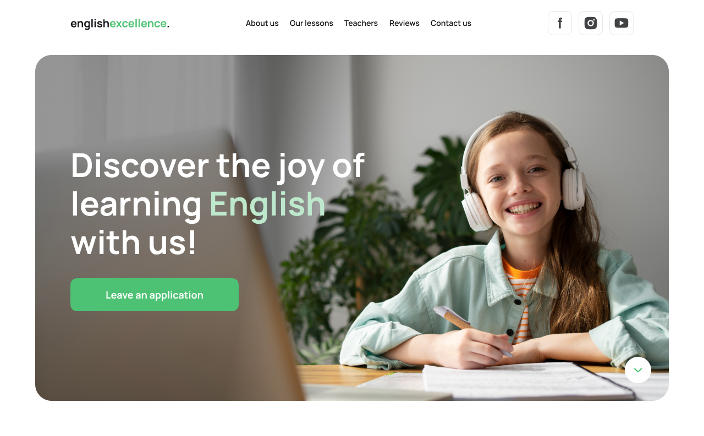

# English Excellence

Welcome to **English Excellence**! Discover the joy of learning English with
engaging lessons, experienced teachers, and a nurturing environment. This README
file provides an overview of the content and features offered by English
Excellence.

## Table of Contents

- [About Us](#about-us)
- [Our Lessons](#our-lessons)
- [Teachers](#teachers)
- [Testimonials](#testimonials)
- [Contact Us](#contact-us)

---

## About Us

We are dedicated to providing engaging and effective English language courses in
a supportive and stimulating learning environment. Our highlights include:

1. **Expert, innovative teaching staff**
2. **Wide range of course levels and options**
3. **Multicultural learning environment**
4. **Comprehensive language support services**

---

## Our Lessons

Our lessons are carefully structured and interactive, designed to promote rapid
language acquisition through practical tasks and real-world scenarios.

### Lesson Packages

| **Plan**       | **Price** | **Description**                                                         |
| -------------- | --------- | ----------------------------------------------------------------------- |
| **Practice**   | $40/month | Collaborative group exercises to boost conversational skills.           |
| **Standard**   | $70/month | A balanced approach covering reading, writing, listening, and speaking. |
| **Individual** | $99/month | Tailored learning focused on individual goals with personal feedback.   |

---

## Teachers

Meet our team of dedicated educators:

- **Maria**: Specialist in beginner-level instruction with warmth and patience.
- **Artem**: Innovator in interactive teaching methods, keeping students
  motivated.
- **Ilona**: Advanced English expert focusing on complex language tasks.
- **Volodymyr**: Career-specific language instructor tailoring lessons to
  individual needs.

---

## Testimonials

Hear from our students about their experiences:

- **Anna**: "The teachers are dedicated, and the learning environment is
  stimulating. I feel more confident in my English skills."
- **Mykhailo**: "The personalized feedback has helped me improve my weak areas."
- **Victoria**: "I love the dynamic and interactive teaching methods. I've seen
  significant improvement in my language skills."

---

## Contact Us

We’d love to hear from you! Use the form on our website to leave an application
or contact us directly.

- **Phone**: +380 (68) 443-94-26
- **Address**: 32a M. Bazhana Avenue

By clicking "Send" in our contact form, you agree to our Privacy Policy and
allow Promodo to use this information for marketing purposes.

---

## Getting Started

To start working with the project locally, follow these steps:

### Clone the Repository:

`git clone https://github.com/bonny-art/code-crafters-tp-02.git`

### Install Dependencies:

**Using Yarn:** `yarn install`

**Using npm:** `npm install`

### Run the Application:

**Using Yarn:** `yarn dev`

**Using npm:** `npm run dev`

### Open in Your Browser:

[http://localhost:5173](http://localhost:5173)

---

## Technologies Used

1. **HTML** - The standard markup language for creating web pages and web
   applications.
2. **CSS** - A stylesheet language used to describe the presentation of a
   document written in HTML.
3. **PostCSS** - A tool for transforming CSS with JavaScript plugins, enabling
   features like autoprefixing, minification, and custom transformations.
4. **JavaScript** - A programming language that enables dynamic interactions on
   web pages, making them interactive and responsive.
5. **Swiper** - A mobile-friendly touch slider with hardware-accelerated
   transitions and smooth interactions.
6. **Vite** - A fast, next-generation build tool that provides an optimized
   development environment for modern web projects.

## Design

The design layout was created in Figma. You can view it
[here](https://www.figma.com/design/MrdZUmIfeT1bKd8u5GWLRt/English-Excellence-2.0?node-id=0-1&t=fBXViomed2IfRe73-1).
